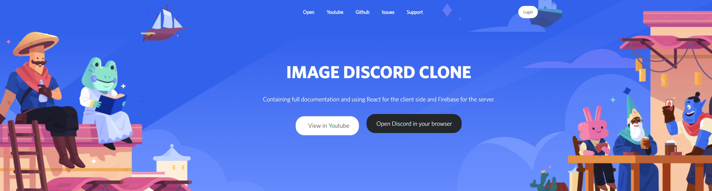

# DiscordClone

# Framework
- [React for front-end](https://reactjs.org/)
- [Firebase for server](https://firebase.google.com/) (Firestore is a gold mine!)
- And other bookstores, the list will be too long. I quote only the main ones...

# Utils 
 - [Live Demo](https://livedemo)
 
 
 - [Youtube Video](https://youtube.com)

# General Structure

