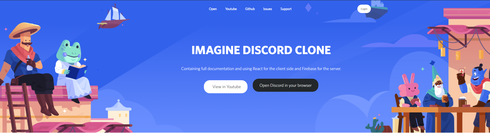

# Firecord

The project is still in beta, but the main features are already present.


Youtube Video -> Soon !

# Main Framework
### Client 
- [React](https://reactjs.org)
- [TailwindCSS](https://tailwindcss.com)

### Server

- [Firebase](https://firebase.google.com) (Firestore is a gold mine!)
- [Redux](https://reactjs.org)

# General Structure


```
src 
  └──server
     └── components 
        └── channel
                └── chat
                └── list
                └── show

        └── server
           └── assets

        └── UI
           └── CSS
           └── Sidebar 
     └── assets
        └── img
        └── audio
        └── video
 
  └── utils
     └── assets
     └── audio
     └── route

  └── store 
     └── Channel
     └── Server

  └── auth 
     └── backend 

  └── page 
     └── components 
```


# Run Locally (basic instruction)

Install all packages

- ``npm install``

Launch app.

- ``npm start``

Edit .env file, and put informations of your firebase data.

## Donation~Support


| Bitcoin | Ethereum | 
|----------------|:-------------| 
``3FahtNWC4tmZh1B72vz44TvBN2jHaQSnh4`` | ``0x7cad12dfd11bce3f29b96260b4739caa32c89a86``   | 

# I love easters-eggs...

Can you find them all?
